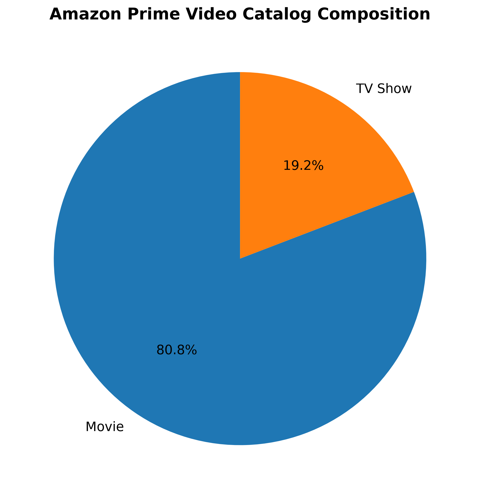
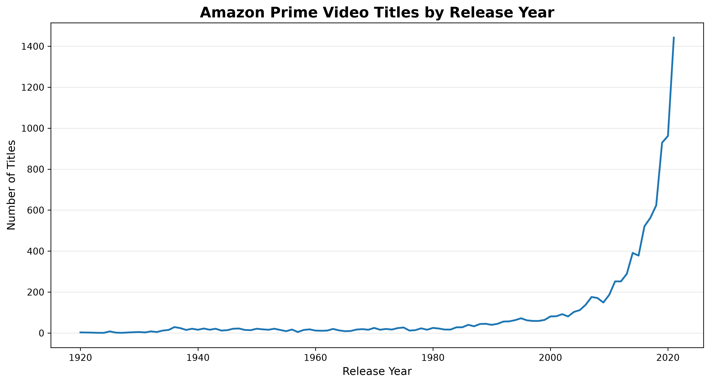
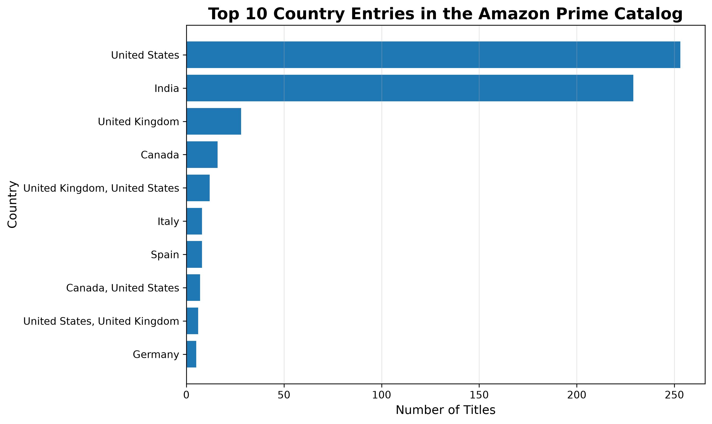
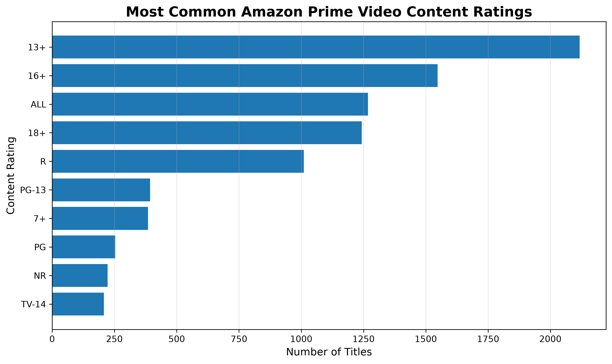
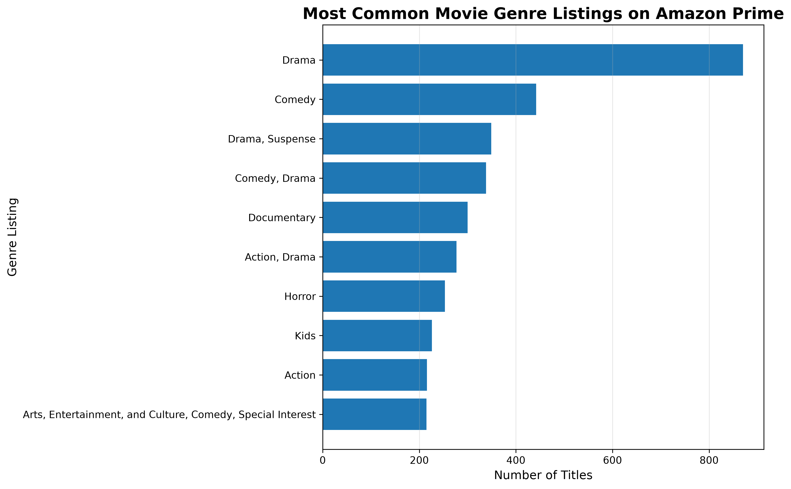

# Amazon Prime Video Catalog Analysis

### SQL Business Case Study

SQL business case study analyzing Amazon Prime Video's content catalog to uncover insights into content distribution, ratings, genres, and global trends.

| Metric | Value |
|--------|------:|
| Total Titles | **9,668** |
| Movies | **80.82%** |
| TV Shows | **19.18%** |
| Average Movie Runtime | **91.31 min** |
| Largest Contributors | **India, United States** |
| Most Common Movie Genre | **Drama** |

---

## Catalog Composition



Approximately **81%** of Amazon Prime Video's catalog consists of movies, while television series account for **19%**, highlighting the platform's strong emphasis on feature-length content.

---

# Executive Summary

This project analyzes Amazon Prime Video's content catalog using SQL to uncover trends in catalog composition, geographic distribution, content ratings, runtime characteristics, and genre distribution.

Rather than focusing solely on SQL syntax, this project approaches the dataset from the perspective of a business analyst tasked with summarizing the current state of Amazon Prime Video's catalog for leadership. Through ten business-driven SQL investigations, the analysis demonstrates how SQL can be used to transform raw data into actionable business insights while identifying opportunities to improve data quality and reporting.

---

# Business Problem

Streaming services manage thousands of titles across multiple countries, genres, and audience demographics. Understanding the composition of a content catalog helps stakeholders evaluate content distribution, identify market strengths, and improve future reporting.

The objective of this project was to analyze Amazon Prime Video's catalog using SQL and communicate meaningful findings through an executive-style report.

---

# Dataset

| Item | Details |
|------|---------|
| Source | Kaggle – Amazon Prime Movies and TV Shows |
| Database | SQLite |
| Language | SQL |
| Records Analyzed | 9,668 Titles |

---

# Business Questions

This project answers ten business-focused questions:

- How large is Amazon Prime's content catalog?
- Is the platform primarily Movies or TV Shows?
- Which countries contribute the most content?
- What audiences are represented by the platform's content ratings?
- How has the catalog evolved over time?
- Which directors appear most frequently?
- What are the longest titles available?
- What is the average runtime of a movie?
- How do countries differ in their Movie versus TV Show contributions?
- Which genres are most common across Movies and TV Shows?

---

# Key Findings

## 🎬 Catalog Composition


Amazon Prime is primarily a **movie-first platform**, with roughly **81%** of the catalog consisting of films and **19%** television series.

---

## 📈 Release Trends



Title counts increase substantially in more recent release years, indicating Amazon has invested heavily in expanding its modern catalog while continuing to offer older titles.

Because the dataset ends in **2021**, this trend should not be interpreted beyond the available data.

---

## 🌎 Global Distribution



India and the United States contribute the largest number of titles.

Notably:

- India's catalog is overwhelmingly movie-focused.
- The United States maintains a more balanced mix of movies and television.

This demonstrates distinct regional content strategies across the platform.

---

## 🏷 Content Ratings



The catalog spans a wide range of audience ratings, illustrating Amazon Prime Video's effort to provide programming for children, families, and adult audiences.

---

## 🎭 Genre Distribution



Drama emerged as the dominant movie genre, followed closely by Comedy and Documentary content.

Because multiple genres are stored within a single field, genre frequencies represent genre combinations rather than fully normalized categories.

---

## ⏱ Runtime Analysis

The average movie runtime is **91.31 minutes**, consistent with a traditional feature-length film.

Interestingly, the longest titles were primarily ambient sleep and relaxation videos rather than conventional movies, highlighting the importance of validating assumptions before drawing conclusions.

---

## ⚠ Data Quality Observations

Several common data-quality issues were identified:

- Multiple rating systems within the same dataset
- Multiple countries stored in a single field
- Multiple genres stored in a single field
- Production companies appearing as directors
- Invalid metadata entries (for example, `"1"`)

These challenges demonstrate why data cleaning is often one of the most important steps in the analytics process.

---

# SQL Skills Demonstrated

Throughout this project I used SQL to:

- **COUNT()**
- **AVG()**
- **WHERE**
- **GROUP BY**
- **ORDER BY**
- **CAST()**
- **ROUND()**
- **REPLACE()**
- **LIMIT**
- Multi-column aggregation
- Business-oriented exploratory analysis

---

# Business Recommendations

Based on this analysis, I would recommend:

- Continue monitoring regional catalog composition to maintain a balanced global library.
- Standardize metadata fields such as ratings, genres, countries, and directors.
- Normalize multi-value fields to improve reporting accuracy.
- Combine catalog metadata with engagement or viewing data to better understand audience preferences.

---

# Future Improvements

Future versions of this project could include:

- Database normalization
- Interactive Power BI dashboard
- Tableau dashboard
- Genre trends over time
- Analysis using `date_added`
- Advanced SQL techniques including Common Table Expressions (CTEs) and Window Functions

---

# Project Structure

```text
amazon-prime-video-sql-analysis/
│
├── README.md
├── amazon_prime_analysis.sql
├── amazon_prime_titles.csv
├── amazon_prime_video.sqlite
├── visualization.py
└── images/
    ├── movie_vs_tv.png
    ├── release_trend.png
    ├── top_countries.png
    ├── ratings_distribution.png
    └── top_genres.png
```
